# Multi-Agent Sales Simulator 🎯


A highly modular, agentic AI system designed to simulate realistic B2B sales conversations. Built with modern Python (>=3.13), this application leverages LangGraph to orchestrate dynamic interactions between a simulated Sales Executive and a Customer, utilizing Retrieval-Augmented Generation (RAG), long-term memory, and enterprise-grade observability.

---

## 🚀 Key Features

* **Multi-Agent Orchestration:** A central Orchestrator dynamically routes conversations between the human user, the AI Sales Executive, and the AI Customer using strict `StrEnum` routing.
* **Enterprise Observability:** Deep, open-source tracing of LangGraph executions, custom Python functions (RAG/Database latency), and LLM token usage via a local **Opik** deployment.
* **Flexible LLM Support:** Seamlessly toggle between **Azure OpenAI** and **Groq** via environment variables without changing a single line of code.
* **Advanced RAG Pipeline:** Ingest `.pdf` and `.txt` product sheets into a local **FAISS** vector store using **Hugging Face (`gte-base`)** embeddings (with automatic Apple Silicon `mps` acceleration).
* **Dual Memory Architecture:** * **Short-Term:** Official LangGraph MongoDB Checkpointer maintains precise turn-by-turn state across UI sessions.
  * **Long-Term:** MongoDB persistence for storing and retrieving historical customer profiles and prior objections.
* **Decoupled Stack:** A robust **FastAPI** backend powering a highly responsive **Chainlit** frontend.
* **Lightning Fast Setup:** Managed entirely by `uv` for instantaneous dependency resolution and virtual environment creation.

---

## 🏗️ Architecture

```mermaid
%%{init: {'theme': 'base', 'themeVariables': { 'primaryColor': '#0a192f', 'primaryTextColor': '#ccd6f6', 'primaryBorderColor': '#ccd6f6', 'lineColor': '#ccd6f6', 'secondaryColor': '#172a45', 'tertiaryColor': '#172a45'}}}%%
graph LR
    %% USER/FRONTEND AREA
    subgraph UI ["Chainlit Frontend (Port 8001)"]
        CL[ui/app.py <br/> Main Chat Interface]
    end

    %% CORE APPLICATION AREA (FastAPI Backend)
    subgraph FASTAPI ["FastAPI Backend (Port 8000)"]
        ROUTE[app/api/routes.py <br/> API Route Handler]
        CFG[app/core/config.py <br/> Configuration]
        FAC[app/core/llm_factory.py <br/> LLM Client Factory]

        %% Nested LangGraph Architecture Engine
        subgraph LANGGRAPH ["LangGraph Orchestration Engine"]
            INIT_G[app/agents/orchestrator/graph.py]
            ORCH[Orchestrator Node]
            SALES[Sales Exec Node]
            CUST[Customer Node]
        end
    end

    %% LOCAL DATA & PERSISTENCE AREA
    subgraph DATA ["Local Data & Memory"]
        MONGO[(MongoDB)]
        FAISS[(FAISS Index)]
    end

    %% AI SERVICES & TELEMETRY AREA
    subgraph SERVICES ["AI Services & Telemetry"]
        LLM[LLM Provider <br/> Azure OpenAI or Groq]
        HF[Hugging Face <br/> gte-base Embeddings]
        
        subgraph OPIK ["Opik Observability (Local Docker)"]
            OPIK_API[Opik API]
            OPIK_UI[Opik Dashboard <br/> Port 5173]
        end
    end

    %% KEY INTERCONNECTIONS & FLOWS
    CL ==>|"1. POST /chat"| ROUTE
    ROUTE ==>|"2. similarity_search"| FAISS
    ROUTE ==>|"3. Initialize Graph"| INIT_G
    INIT_G ==>|"4. Execute"| ORCH

    %% Graph Routing Loop
    ORCH ==>|"5a. command 'sales_exec'"| SALES
    ORCH ==>|"5b. command 'customer'"| CUST
    ORCH ==>|"5c. command 'end'"| ROUTE

    %% Automated Operations
    ORCH -.->|"LLM Command"| LLM
    SALES -.->|"LLM Query + context"| LLM
    CUST -.->|"LLM Query + profile"| LLM

    SALES -.->|"Memory Update"| MONGO
    CUST -.->|"Memory Update"| MONGO
    ORCH -.->|"State Update"| MONGO
    
    ROUTE -.->|"Config Request"| CFG
    FAISS -.->|"gte-base request"| HF
    
    %% Tracing / Telemetry Flows
    ROUTE -.->|"Custom Traces"| OPIK_API
    ORCH -.->|"Automated Traces"| OPIK_API
    SALES -.->|"Automated Traces"| OPIK_API
    CUST -.->|"Automated Traces"| OPIK_API
    
    %% Human Feedback Loop
    CL ==>|"6. POST /feedback"| ROUTE
    ROUTE -.->|"7. Log Feedback"| OPIK_API
    
    %% Internal Services
    LLM -.->|"Automated Traces"| OPIK_API
    OPIK_API === OPIK_UI
    
    %% CUSTOM STYLING
    classDef ui_box fill:#ccd6f6,stroke:#0a192f,color:#0a192f,stroke-width:2px,rx:5,ry:5;
    classDef api_box fill:#172a45,stroke:#ccd6f6,color:#ccd6f6,stroke-width:2px,rx:5,ry:5;
    classDef graph_box fill:#0a192f,stroke:#ffd700,color:#ffd700,stroke-width:3px,stroke-dasharray: 5 5,rx:10,ry:10;
    classDef data_box fill:#4db33d,stroke:#fff,color:#fff,stroke-width:2px,rx:15,ry:15;
    classDef opik_box fill:#ffd700,stroke:#000,color:#000,stroke-width:2px,rx:5,ry:5;
    classDef llm_box fill:#fff,stroke:#000,color:#000,stroke-width:1px;

    class CL ui_box;
    class ROUTE,CFG,FAC api_box;
    class INIT_G,ORCH,SALES,CUST graph_box;
    class MONGO,FAISS data_box;
    class LLM,HF llm_box;
    class OPIK_API,OPIK_UI opik_box;
```



---

## 🛠️ Prerequisites

* **Python:** `>= 3.13`
* **Package Manager:** `uv`
* **Database:** MongoDB (Local or Atlas)
* **Container Engine:** Docker required for local Opik Observability. 
  * *macOS Users:* **OrbStack** is highly recommended as a lightweight, fast, and battery-friendly alternative to Docker Desktop. Install via Homebrew:
    ```bash
    brew install orbstack
    ```
    *(Ensure you open the OrbStack application once after installing to start the background daemon).*

---

## ⚙️ Installation & Setup

1. **Clone the repository and enter the directory:**
   ```bash
   git clone <your-repo-url>
   cd sales_simulator
   ```

2. **Install dependencies and create the virtual environment:**
   ```bash
   uv sync
   ```

3. **Activate the environment:**
   ```bash
   source .venv/bin/activate
   ```

4. **Configure Environment Variables:**
   Copy the template and fill in your API keys and MongoDB URI.
   ```bash
   cp .env.template .env
   ```
   *Note: Set `LLM_PROVIDER` to either `azure` or `groq`. The local Opik URLs are pre-configured.*

---

## 📚 Data Ingestion (RAG)

Before running the simulation, populate the FAISS index with product knowledge.

1. Place your product `.pdf` or `.txt` files into `data/sample_docs/`.
2. Open a Python interactive shell and run the ingestion script:
   ```python
   from app.rag.vectorstore import build_and_save_index
   build_and_save_index()
   ```

---

## 🏃‍♂️ Running the Application

### Option 1: VS Code Automation (Recommended)
This project includes heavily optimized `.vscode/launch.json` and `tasks.json` files for a seamless developer experience.

1. Open the **Run and Debug** panel in VS Code.
2. Select **"Run Full Stack"** from the dropdown menu.
3. Hit Play. 

**What happens under the hood?**
The `preLaunchTask` automatically checks for the official Opik repository. If missing, it securely clones it to an ignored `opik-local` folder, spins up the ClickHouse/Redis Docker Compose stack, and *then* simultaneously launches your FastAPI backend and Chainlit UI. 

* **Chainlit UI:** `http://localhost:8001`
* **Opik Observability Dashboard:** `http://localhost:5173`

### Option 2: Terminal (Manual Startup)
If you prefer not to use VS Code, you will need three terminal windows:

**Terminal 1: Start Opik Observability Stack**
```bash
git clone [https://github.com/comet-ml/opik.git](https://github.com/comet-ml/opik.git) ./opik-local
cd ./opik-local && ./opik.sh
```

**Terminal 2: Start the FastAPI Backend**
```bash
uvicorn app.main:app --reload --host 0.0.0.0 --port 8000
```

**Terminal 3: Start the Chainlit UI**
```bash
chainlit run ui/app.py -w --port 8001
```

---

## 📁 Project Structure

```text
sales_simulator/
├── .vscode/               # Debugger (launch.json) and Pre-Launch Tasks (tasks.json)
├── app/                   # FastAPI Backend & LangGraph Engine
│   ├── api/               # REST endpoints
│   ├── core/              # Config (Pydantic) and LLM Factory
│   ├── database/          # MongoDB Checkpointer and Long-Term Memory
│   ├── rag/               # Document ingestion, HF Embeddings, and FAISS
│   ├── agents/            # LangGraph Nodes and Base Classes
│   │   ├── orchestrator/  # Dynamic router (StrEnum) and Graph Compiler
│   │   ├── sales_exec/    # RAG-enabled Sales Agent
│   │   ├── customer/      # Persona-driven Customer Agent
│   ├── prompts/           # Dynamic .py prompt generators
├── data/                  # Local storage for sample docs and FAISS indexes
├── opik-local/            # (Git Ignored) Local Opik Docker deployment
├── ui/                    # Chainlit Frontend application
├── pyproject.toml         # uv dependency definitions
└── .env                   # Environment variables (Azure, Groq, Mongo, Opik)
```